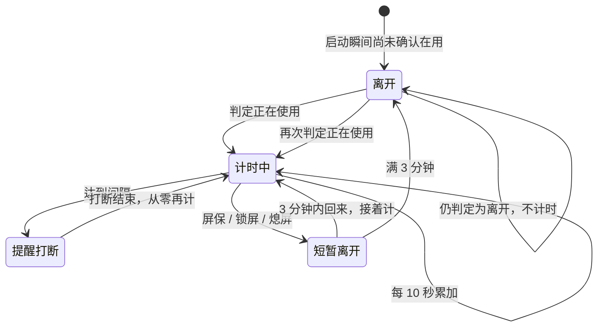

# 连续使用计时 领域知识库

## §0 目录索引

| § | 标题 | 定位 |
|---|------|------|
| §1 | 业务背景与核心概念 | 首次接触该域时读 |
| §1.5 | 架构概览 | 快速建立状态认知 |
| §2 | 核心业务流程/状态机 | 理解计时、离开、到点打断 |
| §2.5 | 物理路径速查 | 直接定位脚本 |
| §3 | 代码入口索引 | 按任务场景找入口 |
| §4 | 表与字段入口索引 | 本地状态文件，无数据库 |
| §5 | 流程/组件/任务入口索引 | 轮询与登录项托管 |
| §6 | 核心业务规则与隐性约束 | 改判断逻辑前必扫 |
| §7 | 验证路径 | 改完后如何确认会响、离开会清零 |
| §8 | 关联文档 | 跨域联读 |
| §9 | 覆盖度与待补充项 | 置信度与缺口 |

## §1 业务背景与核心概念

本域负责：**人连续坐在 Mac 前多久算该起身**，以及**什么算离开、离开后倒数必须清零**。到点后的打断（藏窗口、弹窗、开屏保）也在本域，因为和计时是同一条循环，改间隔或改离开判断都会碰到它。

主称谓：

- **连续使用**：屏幕解锁且未在屏保/锁屏里的累计时长。
- **离开**：屏保、系统锁屏、控制台未登录、系统唤醒。离开后连续使用从零开始。
- **提醒打断**：到点后藏可见窗口、弹出「起身走动一下~」、启动屏保。

别名（只在入口出现）：`is_unlocked` / `away_reason` / `run_daemon` / `fire_reminder`。

来源：用户补充（本机真实离开路径是触发角开屏保再进锁屏）。

## §1.5 架构概览

## §2 核心业务流程 / 状态机

1. 常驻循环每 10 秒看一次：是否离开、是否到点。
2. 从离开转入正在使用：记下起点，日志「检测到解锁，开始计时」。
3. 正在使用期间：把已用秒数写入状态文件；约每分钟打一条「计时中」心跳。
4. 达到间隔：走提醒打断，然后起点清零，继续计时。
5. 发现离开：先进入 3 分钟防抖，日志「检测到离开（原因），未满3分钟回来则继续计时」。原因取值：`screensaver` / `locked` / `loginwindow` 等。此间状态仍为正在计时，倒数接着走，到点不弹（屏幕不在用）。
6. 3 分钟内回来：日志「短离开未满3分钟，继续计时」，起点不变，离开那段也算坐着。
7. 离开满 3 分钟：起点清零，日志「离开已满3分钟，计时已重置」。
8. 进程被休眠冻住超过 3 分钟再醒：日志「休眠已满3分钟，计时已重置」。冻住未满 3 分钟：日志「短唤醒未满3分钟，继续计时」。

终态：无。进程被停掉才结束循环。

## §2.5 物理路径速查

| 目录（相对项目根） | 内容 | 关键类/文件数 |
|------|------|--------|
| `standup-reminder.sh` | 守护循环、离开判断、提醒打断、status | 1 文件 |
| `tests/test.sh` | 前台名解析、ioreg 锁屏键、本机解锁判定、离开防抖阈值 | 1 文件 |
| `docs/TROUBLESHOOTING.md` | 从不响、热角不清零的现象对照 | 1 文件 |

## §3 本域代码入口索引

| 场景 | 入口 | 类/方法/配置 | 说明 |
|---|---|---|---|
| 改「什么算在用电脑」 | `standup-reminder.sh` | `away_reason` / `is_unlocked` | 离开则返回原因；否则视为在用 |
| 改系统锁屏识别 | 同上 | `ioreg_reports_locked` | 会话字典里出现 `CGSSessionScreenIsLocked` 才算锁屏；解锁时该键不存在 |
| 改屏保识别（含热角） | 同上 | `screensaver_running` | 系统「屏保是否在跑」+ 进程名兜底；禁止只扫旧的 `ScreenSaverEngine` |
| 改前台窗口名兼容 | 同上 | `parse_front_name` / `front_app_name` | 新旧两种输出都要认；解析失败不得当成离开 |
| 改计时循环 / 间隔 | 同上 | `run_daemon`；配置项 `interval`（命令 `config set`） | 默认 60 分钟；裸数字按分钟。登录项禁止写死间隔 |
| 改离开防抖 | 同上 | `away_long_enough`；配置项 `away_reset`（默认 3 分钟） | 未满阈值回来必须接着计；离开那段也算坐着 |
| 改到点打断 | 同上 | `fire_reminder`；配置项 `hide_windows` / `show_dialog` / `start_screensaver` / `message` / `title` / `button` / `dialog_timeout` | 演练模式只写日志；防抖离开期间不弹。三项打断都可关 |
| 改用户配置 | 同上 | `cmd_config`；配置文件 `$STATE_DIR/config` | 文件 + 命令是权威入口。环境变量仅覆盖（测试）。守护循环每轮重读，约 10 秒内生效 |
| 立刻试响 | 命令 `now` | `cmd_now` | 不等间隔 |
| 看进度 | 命令 `status` | `cmd_status` + 状态文件 | 必须能回答还有多久 |

## §4 本域表与字段入口索引

无数据库。本地状态文件默认：`~/Library/Application Support/standup-reminder/state`。

| 键 | 业务语义 | 改动注意 |
|---|---|---|
| `session` | `unlocked` 正在计时；否则视为离开 | `doctor` 用它判断健不健康 |
| `unlocked_since` | 本段连续使用起点（unix 秒） | 只有离开满防抖窗口或长休眠才写 0 |
| `elapsed` | 已连续使用秒数 | `status` 用来算「还有多久」；防抖离开期间仍增加 |
| `last_reason` | 最近一次心跳/离开原因 | 防抖中为 `away_pending`；验收热角清零看「离开已满3分钟」 |
| `last_tick` | 上次刷新时间 | 超过约 30 秒未刷新，`status` 视为状态过期 |
| `interval` | 本段使用的间隔 | 与当前生效配置一致；改 `config set interval` 后下一轮心跳会改这个值 |

日志默认：`~/Library/Application Support/standup-reminder/run.log`。

## §5 本域流程 / 组件 / 任务入口索引

| 类型 | 标识 | 代码入口 | 适用场景 |
|---|---|---|---|
| 轮询 | 每 10 秒 | `run_daemon` 里 `sleep` | 短于一轮的离开会被漏扫 |
| 演练 | `STANDUP_DRY_RUN=1` 或 `--dry-run` | `fire_reminder` 各步 | 自动化禁止真开屏保 |

## §6 核心业务规则与隐性约束

- **AI 易错点** 【禁止】看不清前台窗口就把人当成离开 -> 必须按正在使用处理。原因：v0.1.0 系统窗口信息格式一变，解析失败，工具永远不计时、从不提醒。
- **AI 易错点** 【禁止】只靠旧屏保进程名判断离开 -> 必须同时看系统锁屏标记和「屏保是否在跑」。原因：v0.2.0 热角开屏保不走旧进程名，倒数不清零。
- **AI 易错点** 【禁止】一检测到离开或唤醒就清零 -> 必须满 3 分钟（`AWAY_DEBOUNCE_SECONDS`）才清零。原因：v0.2.1 自动熄屏两分钟把人还坐着的计时打断。3 分钟内回来 = 没起身，离开那段也算坐着。
- **AI 易错点** 【消歧】「认出离开」vs「已经清零」：热角停 20 秒只证明日志出现「检测到离开」；清零必须停满 3 分钟看到「离开已满3分钟」。20 秒内解锁出现「短离开未满3分钟，继续计时」是正确防抖。合盖长休眠走「休眠已满3分钟」，**不能**当作热角路径已修好。
- 【叫法统一】正文用「连续使用 / 离开 / 提醒打断」；日志里仍是「解锁 / 离开 / 计时中 / 短离开 / 离开已满」。
- 【隐性依赖】改离开判断后必须本机热角验收（认出离开停满 20 秒；确认清零停满 3 分钟），单测不够。
- **AI 易错点** 【禁止】把间隔写进登录项环境变量，或改完配置却要求用户重装/卸登录项。原因：环境变量会盖住配置文件，看起来 `config set` 成功、后台仍按旧间隔计。正确路径：`config set` 写配置文件，循环每轮重读。
- 【不可配置】轮询 10 秒、判断失败按正在使用、离开必须看锁屏标记+屏保是否在跑——这三项是防「从不响 / 热角不清零」的硬约束，禁止做成开关。
- 【低置信度】「需要密码才进锁屏」的延迟秒数因系统设置而异；热角后可能先是屏保、再变锁屏。证据：用户用热角进入，日志原因是 `screensaver`。待确认：仅锁屏热角（不经屏保）是否稳定打出 `locked`。

## §7 常见易忽略条件与验证路径

- 改离开判断后：`bash tests/test.sh`（含 ioreg 有/无锁屏键、本机应判定已解锁、防抖 179 秒不清零 / 180 秒清零）。
- 本机实装后：`standup-reminder doctor` 须显示正在计时；日志须有「检测到解锁，开始计时」。
- 热角认出离开：触发角开屏保，**画面上停满 20 秒**再解锁。日志须有 `检测到离开（screensaver）` 或 `（locked）`，随后 `短离开未满3分钟，继续计时`。只有唤醒类日志则验收失败。停不够 20 秒会被漏扫。
- 热角确认清零：屏保/锁屏上**停满 3 分钟**再解锁。日志须有 `离开已满3分钟，计时已重置`，之后从零计。禁止把 20 秒内解锁的「继续计时」当成没修好。
- 演练打断：`STANDUP_DRY_RUN=1 standup-reminder now`，日志须有 `DRY_RUN=1`。真弹窗会藏窗口并开屏保，不要在无人值守里跑。

## §8 关联文档

- `docs/INSTALL_RESIDENCY_KNOWLEDGE_BASE.md`：装上、常驻、自检；本域改完要经安装脚本覆盖安装后才在本机生效。
- `docs/TROUBLESHOOTING.md`：从不响、热角不清零的现象对照。
- `docs/OPERATIONS_GUIDE.md`：日志路径、本机安装方式。

## §9 覆盖度与待补充项

- 代码推断覆盖：守护循环、离开原因、状态文件、提醒打断入口已覆盖。
- 领域语言统一：主称谓已按本会话用户说法对齐。
- 用户 / 资料补充：热角屏保是真实离开路径。认出离开须停满 20 秒；确认清零须停满 3 分钟。3 分钟内回来视为没起身、接着计。来源：用户补充（2026-08-15 热角验证；同日确认自动熄屏两分钟不应清零）。
- 多源证据补强：`tests/test.sh`、本机 `run.log`（离开原因=`screensaver`）。
- Q&A 补充：未另开问卷，沿用本会话验证。
- 待补充：仅锁屏热角（不经屏保）的日志原因是否稳定为 `locked`；提醒改成全屏遮罩仍是产品取舍，未立项。

<!-- 该文档由 doc-init 生成于 2026-08-15；定位：AI 修改本业务域前的快速参考文档 -->

<!-- 该文档整理/压缩于 2026-09-05 -->
