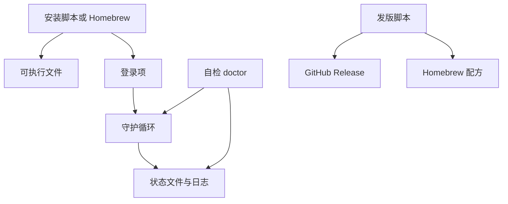

# 安装与常驻自检 领域知识库

## §0 目录索引

| § | 标题 | 定位 |
|---|------|------|
| §1 | 业务背景与核心概念 | 首次接触该域时读 |
| §1.5 | 架构概览 | 安装渠道与本机落点 |
| §2 | 核心业务流程 | 安装、自检、停止、发版 |
| §2.5 | 物理路径速查 | 直接定位脚本 |
| §3 | 代码入口索引 | 按任务场景找入口 |
| §4 | 表与字段入口索引 | 无库；登录项与状态目录 |
| §5 | 流程/组件/任务入口索引 | 登录项、Homebrew 服务 |
| §6 | 核心业务规则与隐性约束 | 改安装/自检/发版前必扫 |
| §7 | 验证路径 | 装完如何证明真的在计时 |
| §8 | 关联文档 | 跨域联读 |
| §9 | 覆盖度与待补充项 | 置信度与缺口 |

## §1 业务背景与核心概念

本域负责：把提醒**装到这台 Mac 上、登录后还在、能证明正在计时、能发版给外人装**。不负责「什么算久坐」（见连续使用计时域）。

主称谓：

- **常驻**：登录后自动跑的后台循环。
- **自检**：不仅看进程在不在，还要看是否正在计时。命令名 `doctor`。
- **本机安装**：这台电脑走仓库里的安装脚本，落到用户本地目录，**不是** Homebrew。两套同时开会重复拉起。

来源：用户补充（本机 2026-08 由安装脚本装上；旧版「已启动」但从未计时）。

## §1.5 架构概览



## §2 核心业务流程

1. **安装脚本**：拷贝脚本 → 写登录项 → 卸旧进程 → 加载 → 等到自检通过才报成功。自检不过则警告并打印自检 / 立刻试响。
2. **Homebrew**：配方把脚本装进前缀，用 brew 服务拉常驻。与安装脚本二选一。
3. **自检**：进程在跑且状态为正在使用且心跳未过期 → 退出码 0。只在跑但判定为离开 → 不健康。
4. **停止**：必须同时卸登录项（和 brew 服务），否则保活会把进程拉回来。
5. **发版**：升版本号 → 测试 → 打标签推送 → `scripts/publish-release.sh` 建 Release 并写 tap（防把配方写回更旧版本）→ 本机再用安装脚本覆盖。

## §2.5 物理路径速查

| 目录（相对项目根） | 内容 | 关键类/文件数 |
|------|------|--------|
| `install.sh` | 本机/一键安装与卸载 | 1 |
| `com.github.x0c.standup-reminder.plist` | 登录项模板 | 1 |
| `standup-reminder.sh` | `status` / `doctor` / `stop` / `now` | 1 |
| `scripts/publish-release.sh` | Release + Homebrew 配方 | 1 |
| `tests/test.sh` | CLI 契约与隔离状态目录 | 1 |
| `.github/workflows/test.yml` | CI 跑测试 | 1 |

## §3 本域代码入口索引

| 场景 | 入口 | 类/方法/配置 | 说明 |
|---|---|---|---|
| 本机安装 | `./install.sh` | `do_install` / `wait_until_counting` | 等到 `doctor` 成功 |
| 卸载 | `./install.sh --uninstall` | `do_uninstall` | 状态目录默认保留 |
| 登录项模板 | `com.github.x0c.standup-reminder.plist` | 标签 `io.github.x0c.standup-reminder` | 安装时替换可执行文件与状态目录占位符。**禁止**再写入提醒间隔环境变量 |
| 用户配置 | `$STATE_DIR/config` | 命令 `config get/set/unset` | 覆盖安装须保留已有配置；若无配置文件则把旧登录项里的间隔迁过去 |
| 自检 | `standup-reminder doctor` | `cmd_doctor` | 退出码 0 才算健康 |
| 进度 | `standup-reminder status` | `cmd_status` | 未运行退出码 1 |
| 停止 | `standup-reminder stop` | `cmd_stop` / `unload_service` | 卸登录项 + brew 服务 |
| 发版 | `bash scripts/publish-release.sh` | 读 `VERSION` | 配方只允许版本不回退 |
| Homebrew 配方 | 仓外 `x0c/homebrew-tap` 的 `Formula/standup-reminder.rb` | 本仓不存副本 | 发版脚本写入 |

## §4 本域表与字段入口索引

无数据库。本机落点：

| 路径 | 业务语义 | 改动注意 |
|---|---|---|
| `~/.local/bin/standup-reminder` | 安装脚本放入的可执行文件 | 改源码后必须再跑安装脚本才生效 |
| `~/Library/LaunchAgents/io.github.x0c.standup-reminder.plist` | 登录项 | 与 brew 服务不要并存 |
| `~/Library/Application Support/standup-reminder/` | 状态、PID、**单实例锁文件**、日志、**配置文件** | 覆盖安装保留 `config`；`doctor` / `status` 读状态文件；常驻用 `standup_reminder.lock` 的 flock/fcntl 排他锁防双开，PID 文件只作展示 |

## §5 本域流程 / 组件 / 任务入口索引

| 类型 | 标识 | 代码入口 | 适用场景 |
|---|---|---|---|
| 登录项 | `io.github.x0c.standup-reminder` | plist `KeepAlive` + `RunAtLoad` | 登录自启、崩溃拉起 |
| Homebrew 服务 | `standup-reminder` | 配方 `service` 块 | 外人推荐安装渠道 |
| CI | `.github/workflows/test.yml` | `bash tests/test.sh` | 不替代本机发版收尾 |

## §6 核心业务规则与隐性约束

- **AI 易错点** 【禁止】安装结束只报「已启动」-> 必须等到自检显示正在计时，否则会重演「进程在跑、从未提醒」。
- **AI 易错点** 【禁止】`stop` 只杀进程不卸登录项 -> 保活会立刻拉回来。
- **AI 易错点** 【禁止】本机发版后只推 GitHub、不跑安装脚本 -> 机主仍在跑旧文件。
- **AI 易错点** 【禁止】单实例只写 PID 文件不持锁 -> 启动竞态下两个守护可同时跑。必须对 `standup_reminder.lock` 做非阻塞排他锁（`flock(1)` 或 python `fcntl.flock`），PID 仅供文案/status。
- 【禁止】Homebrew 与安装脚本两套常驻同时开。`doctor` 会提示，必须只留一套。本机约定留安装脚本。
- 【禁止】登录项或 Homebrew 服务写死 `REMINDER_INTERVAL`。发版脚本必须把配方里这类行剥掉。否则 `config set` 改了文件，后台仍用旧间隔。
- 【禁止】发版把 Homebrew 配方写成比现网更旧的版本。
- 【隐性依赖】提交信息若被工具加上 AI 署名，推送前必须去掉；`git commit --amend` 可能再次注入，需改用无署名的提交对象后再推。
- 【叫法统一】正文用「常驻 / 自检 / 本机安装」；对外 README 仍写 Homebrew 为推荐渠道。

## §7 常见易忽略条件与验证路径

- 脚本测试：`bash tests/test.sh`（隔离状态目录，不碰本机常驻）。
- 本机覆盖安装：`./install.sh`，须打印「已经在计时」。
- 自检：
  ```bash
  STANDUP_FORCE_TEXT=1 ~/.local/bin/standup-reminder doctor
  STANDUP_FORCE_TEXT=1 ~/.local/bin/standup-reminder --version
  ```
  版本须与源码 `VERSION` 一致，自检须通过。
- 日志：`tail -20 "$HOME/Library/Application Support/standup-reminder/run.log"`
- 发版后核 GitHub Release 与 tap 配方的 tag 一致；**不**另开版本号只为改文档。

## §8 关联文档

- `docs/CONTINUOUS_USE_KNOWLEDGE_BASE.md`：计时与离开；自检「正在计时」依赖该域状态文件。
- `docs/TROUBLESHOOTING.md`：装了不响、两套常驻、停止后又起来。
- `docs/OPERATIONS_GUIDE.md`：日常启动与日志。

## §9 覆盖度与待补充项

- 代码推断覆盖：安装脚本、登录项、自检、停止、发版脚本已覆盖。
- 用户 / 资料补充：本机走安装脚本。来源：用户补充。
- 待补充：Windows/Linux 明确不支持，无跨平台安装域。

<!-- 该文档由 doc-init 生成于 2026-08-15；定位：AI 修改本业务域前的快速参考文档 -->

<!-- 该文档整理/压缩于 2026-09-05 -->
